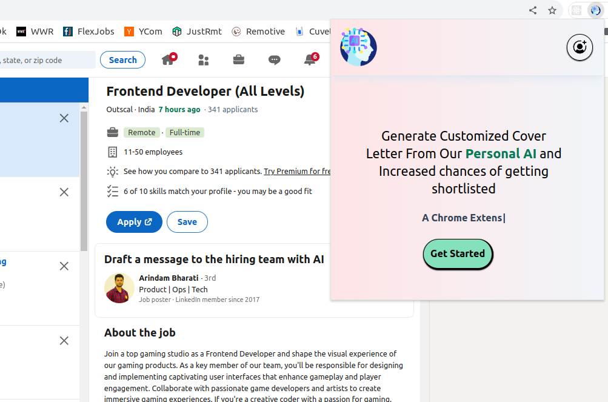
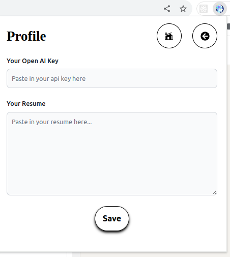
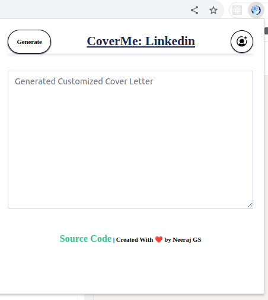
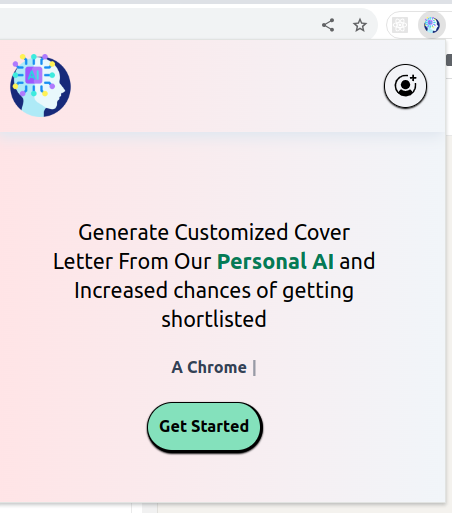

# CoverMe:AI Chrome Extension

A Google Chome Extension that uses the Power of AI and generates Cover Letters for Jobs.
The Extension takes in THe Users Resume, Scrapes the Job Description , Combines both of them and then Generates a customized Cover Letter. I have used Local Storage to store the API key of the User and also their Resume.


### Features

- Scraping the Job Description
- Google Local Storage
- AI Integrated
- Currently Only for Linkedin Website


### Tech Stack

- ReactJs
- JavaScript
- Open AI API
- Tailwind CSS


## Screenshots









## Run Locally

Clone the project

```bash
  git clone https://github.com/neeraj-gs/CoverMe-AI-Chrome-Extension.git
```

Go to the project directory

```bash
  cd cover-me
```

Install dependencies

```bash
  npm install
```

Build the Project

```bash
  npm run build 
```

Load Unpacked build folder to chrome extension 
```bash
  chrome://extensions/
  Load Unpacked 
  Add the build folder to add extension to chrome 
```

Go to Extensions and Pin the project
```bash
  You can right click and inspect the extension and check the working
```

Go to Linkedin Jobs and Click on Extension
```bash
  https://www.linkedin.com/jobs/collections/recommended/
```

You are All set to Generate Cover letters using AI
```bash
  Enter Your OpenAI API key and Resume and then click on Generate to get the Cover Letter
```


### Future Work

- As of now the Cover Letter Generation is set only for Linkedin Website, will be extending to all the JOb Finding Sites.

- Will try are Crete a Micro-SaaS and allow users to only enter resume and not thier Open AI API key and generate their Cover Letter.